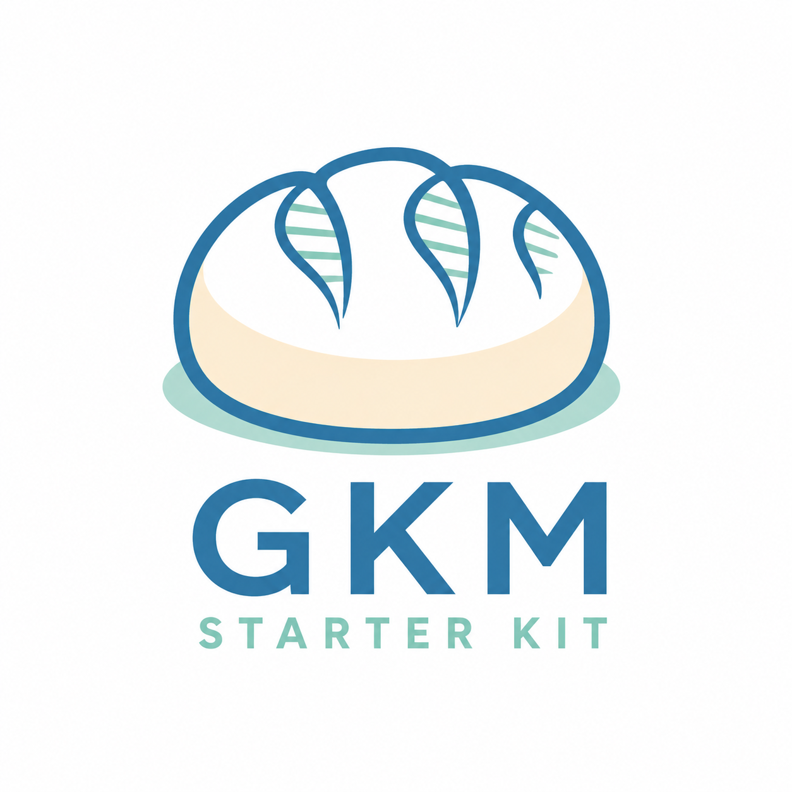

# Python Package

{: width="300" style="display: block; margin: 0 auto;"}

`gkm.starter` is the Starter Kit's Python package for loading a producer's GKM
bundle, exploring its contents, following relationships, and writing it back to
JSON.

## Install

The package requires Python 3.11 or later. Install it from PyPI:

```shell
python3 -m pip install gkm.starter
```

Import the package as `starter`:

```python
from gkm import starter
```

## What you can do

- Load producer JSON with its producer-defined schema.
- Discover the collections provided by a producer.
- Work with supported values as GKM Python models.
- Follow relationships between objects without manually navigating JSON paths.
- Write the bundle back to JSON while preserving producer-specific content.
