{ .gkm-logo }

# Pillar II: Toolkit

The Genomic Knowledge Model (GKM) Toolkit is a Python package that gives the
community a **practical entry point for adopting GKM standards** in real
projects. This pillar connects the standards to **real workflows**.

The GKM Toolkit helps you:

- **Validate and work with** GKM objects as Python models using the [GKM Python
  reference implementations](../about.md#standards-and-reference-implementations).
- **Load** producer-published GKM Bundles and their schemas.
- **Explore** collections of genomic knowledge and the relationships between objects.
- **Preserve** producer-specific content when processing or writing bundles.

## Explore the GKM Toolkit

- :material-rocket-launch: [**Get set up**](installation.md)

    Install the GKM Toolkit and choose the dependencies you need.

- :material-notebook-outline: [**See examples**](notebooks/index.md)

    Read guided notebook examples online, or learn how to run them yourself.

- :material-language-python: [**Python API Reference**](api/index.md)

    Read the API documentation for the package and its functionality.

- :material-source-pull: [**Help improve the GKM Toolkit**](../development.md)

    Contribute code and/or documentation.

